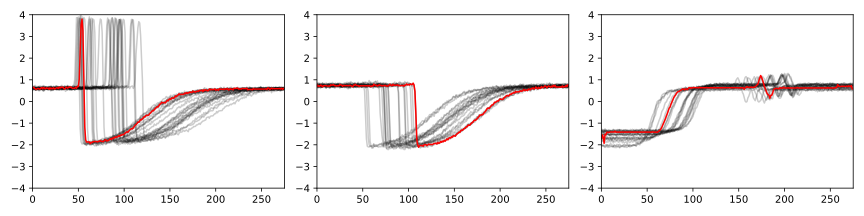

# Données séries temporelles

Ces données sont issues du jeu de données "Trace" diffusé via l'archive UCR/UEA Time Series Classification.
Le script permettant de les générer est `gen_data.py`, et la figure ci-dessous permet de se faire une idée (chaque trait gris correspond à une série temporelle et le trait rouge est un barycentre au sens de la similarité Dynamic Time Warping) :

Les données sont disponibles dans le fichier `time_series.csv`, dans lequel une ligne correspond à une série temporelle (fichier CSV avec pour séparateur `;`).
L'information de classe n'est pas fournie dans le fichier.